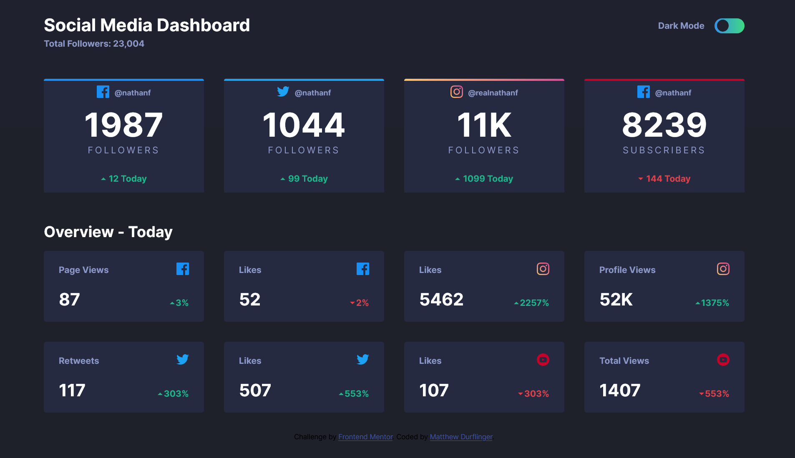

# Frontend Mentor - Social media dashboard with theme switcher solution

This is a solution to the [Social media dashboard with theme switcher challenge on Frontend Mentor](https://www.frontendmentor.io/challenges/social-media-dashboard-with-theme-switcher-6oY8ozp_H). Frontend Mentor challenges help you improve your coding skills by building realistic projects. 

## Table of contents

- [Overview](#overview)
  - [The challenge](#the-challenge)
  - [Screenshot](#screenshot)
  - [Links](#links)
- [My process](#my-process)
  - [Built with](#built-with)
  - [What I learned](#what-i-learned)
  - [Continued development](#continued-development)
  - [Useful resources](#useful-resources)
- [Author](#author)

**Note: Delete this note and update the table of contents based on what sections you keep.**

## Overview

### The challenge

Users should be able to:

- View the optimal layout for the site depending on their device's screen size
- See hover states for all interactive elements on the page
- Toggle color theme to their preference

### Screenshot

### Links

- Solution URL: [https://www.frontendmentor.io/solutions/sass-and-flexbox-with-a-tiny-bit-of-js--7FSKRYaH](https://www.frontendmentor.io/solutions/sass-and-flexbox-with-a-tiny-bit-of-js--7FSKRYaH)
- Live Site URL: [https://sharp-tereshkova-f87839.netlify.app/](https://sharp-tereshkova-f87839.netlify.app/)

## My process

### Built with

- Semantic HTML5 markup
- CSS custom properties
- Flexbox
- JavaScript

### What I learned

I was able to experiment with some flexbox properties which were quite interesting such as grow and shrink. Using css variables to easily change colour schemes with JavaScript was also a very useful thing to learn.

### Continued development

I'd like to continue focusing on using flex to scale pages as they are resized. I ended up not using flex and grow for this particular project and kept the modules a constant size but I can see where the flex and grow can be very useful.

### Useful resources

- [https://www.w3schools.com/howto/howto_css_switch.asp](w3schools Toggle Switch) - This helped me to create the slider toggle. It is a good starting point for anyone needing one. Although I did find some open source ones that might be useful for other projects in the following link
- [https://freefrontend.com/css-toggle-switches/](https://freefrontend.com/css-toggle-switches/) - This sote in general is a great resource and I will be using it in the future

## Author

- Frontend Mentor - [@mattyd96](https://www.frontendmentor.io/profile/mattyd96)

